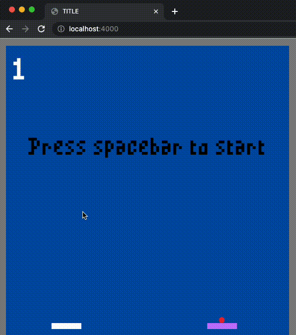

# Ball Bounce 

You can play the game here: https://tlietz.github.io/Ball-Bounce-Client/index.html

Ball Bounce is a game created in Rust using the [macroquad](https://github.com/not-fl3/macroquad) game engine.
It is compiled to wasm so that it can be played in a browser. For now, it is has local multiplayer with 2 players and keyboard controls.

Move the white paddle using the `A` and `D` keys. 

Move the purple paddle using the left and right arrow keys.

## Code Architecture

It has an ECS-like (entity component system) architecture.

The `Player` and `Ball` are entities, which are represented by `struct`s.

`Velocity`, `Position`, and `Control` are components, which are also represented by `struct`s. Entities can have any number of components depending on what characteristics they need. For example, the `Ball` entity does not have a `Control` component, but the `Player` entities do.

Systems are functions that control everything.
All of the complexity of the game logic is contained in the systems. This made it easy to know where features of the game should be created during the game. If we were to use OOP, it would not be as easy because games have many features that require the interaction between mutliple objects. 

For example, let's look at adding the feature of bouncing a ball off a paddle. 
In OOP, we would have to decide whether to add the method to the `Ball` or `Player` object. Does a ball bounce off the paddle, or does the paddle bounce the ball?

In ECS, a system takes in the `game_state` and determines what happens. 
The system is external to both the `Ball` and the `Player`, so we no longer have to worry about which one to put a method on like we would with OOP.

## Future Work

Make a `GameState` enum to replace the currently used `BallState`. This will allow adding states like `Pause`, and `Menu`. 

Then, create a `game_state_system` that handles changing the `GameState` enum.
For example, pressing the `p` button for pause, and pressing `q` to quit. 